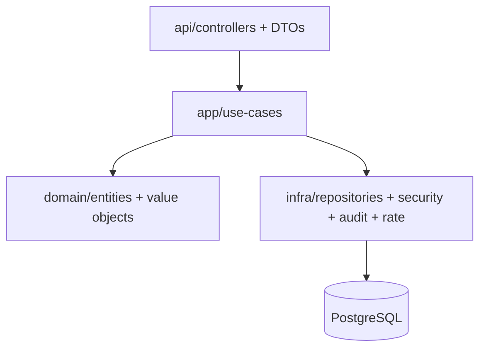

# Secure SaaS Starter Kit (Backend)

Production-ready Spring Boot 3 + Java 21 starter for secure, multi-resource SaaS APIs with enterprise-grade defaults.

## What You Get
- Clean architecture with clear boundaries (`api`, `app`, `domain`, `infra`, `config`)
- JWT access + rotating refresh tokens, RBAC, resource-level authorization
- Audit logging, rate limiting (in-memory + optional Redis), security headers
- PostgreSQL 16 + Flyway migrations, OpenAPI docs, HTTP samples
- Testcontainers integration tests + unit tests for security-critical logic
- CI workflow, ADRs, deployment guidance, threat model, and security checklists

## Quickstart
```bash
cp .env.example .env

docker-compose up -d db
mvn spring-boot:run
```

OpenAPI UI:
```bash
open http://localhost:8080/swagger-ui
```

## Make It Run
```bash
# Start infrastructure
 docker-compose up -d db

# Run the app
 mvn spring-boot:run

# Run tests (unit + integration)
 mvn test
```

## Architecture Highlights
Mermaid diagram (high-level):


Key flows:
- Controllers call use-cases in `app`
- Domain models remain small and focused
- Infra layer owns persistence, auth, and integration details

## Security Features
- JWT access tokens + rotating refresh tokens
- BCrypt password hashing
- Account lockout after repeated failures
- RBAC with roles and permissions
- Method-level + resource-level checks
- Audit logging with requestId, actor, IP, userAgent
- Rate limiting per-IP + per-user (auth + API)
- Security headers (CSP, HSTS, X-Content-Type-Options)
- CSRF tokens for browser sessions (API routes excluded)
- Input validation + safe error responses
- Secrets via env vars and `.env.example`

## Extension Points
- `infra/security` for SSO/SAML providers
- `infra/audit` for SIEM export
- `app/security` for custom permission models
- `infra/rate` for advanced rate limiting
- `app/*` for new use-cases and resources

## Roadmap (Advanced Modules)
- SSO/SAML integrations (Okta/Entra) with tenant discovery
- Hard multi-tenant isolation (schema-per-tenant)
- SIEM export pipeline for audit logs
- SOC2/ISO compliance pack and evidence automation
- WAF rules + bot protection presets

## Need Help?
We offer:
- Architecture review + security hardening
- Custom integrations (SSO, billing, audit exports)
- Cloud migration (AWS/GCP/Azure)
- Threat modeling + penetration testing

Contact: [Book a Call](https://calendly.com/dzaimov-nexuvault/strategic-business-systems-call)

## Docs
- `docs/ARCHITECTURE.md`
- `docs/THREAT_MODEL.md`
- `docs/SECURITY_CHECKLIST.md`
- `docs/SECRETS_CHECKLIST.md`
- `docs/DEPLOYMENT.md`
- `docs/ROADMAP.md`
- `docs/adr/`
- `docs/http/`
