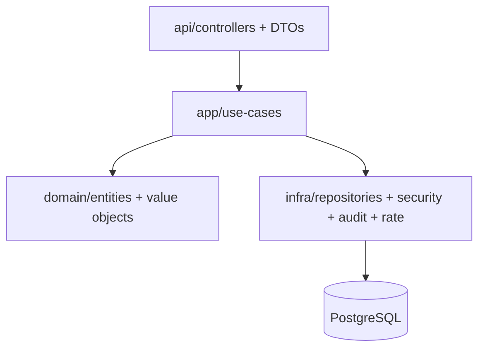

# Architecture

## Goals
- Keep business logic in `app` and `domain`
- Push infrastructure concerns to `infra`
- Provide explicit extension points for security and integrations

## High-Level Diagram

## Key Modules
- `api`: Controllers + request/response DTOs
- `app`: Use-cases (auth, workspaces, projects, api keys, invitations)
- `domain`: Entities and enums (RBAC roles + permissions)
- `infra`: DB repositories, JWT, API key auth, audit log filter, rate limiting
- `config`: Spring configuration, OpenAPI, security configuration

## Security Boundaries
- Authentication handled by JWT and API key filters
- Authorization enforced with method-level `@PreAuthorize`
- Workspace-level checks centralized in `WorkspaceAuthorizationService`

## Extension Points
- Add SSO providers in `infra/security`
- Add SIEM exporter in `infra/audit`
- Implement tenant isolation in `infra/db` and `app/security`
